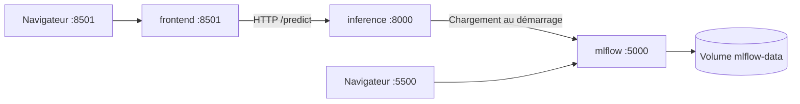
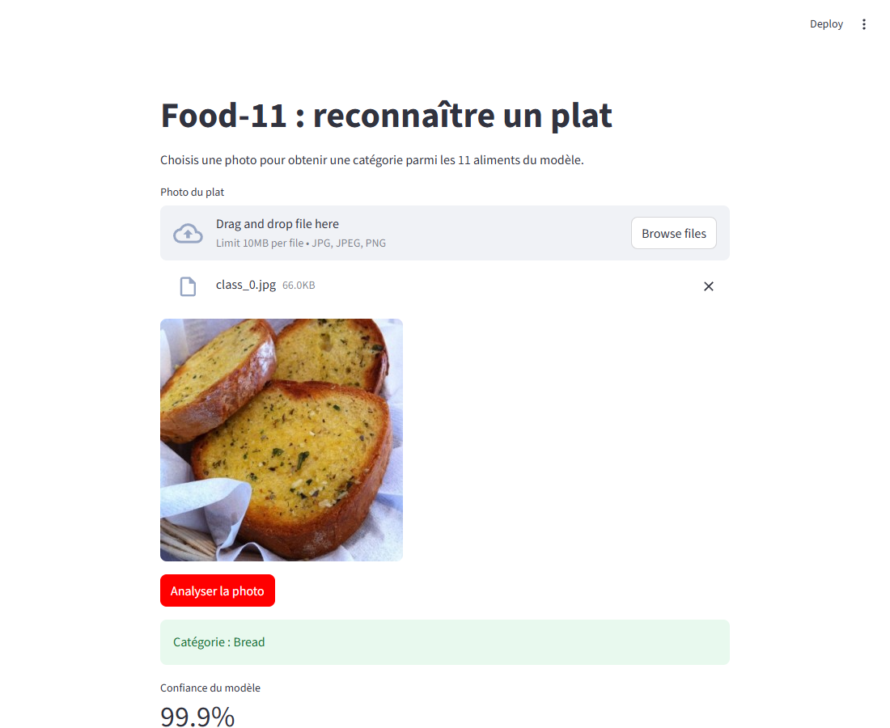

# Lab 4 — Orchestrer Food-11 avec Docker Compose

## Objectif et réalisation

Le modèle ResNet18 entraîné au Lab 2 et servi au Lab 3 est utilisé par trois services : MLflow conserve le registre et les artefacts, FastAPI réalise l'inférence, et Streamlit propose l'envoi d'une photo. Aucun réentraînement n'est nécessaire.



L'alias `champion` remplace le stage historique `Staging` de l'énoncé, comme au Lab 3. Le serveur MLflow fournit les artefacts par HTTP : un chemin local dans son conteneur ne serait pas accessible depuis le conteneur d'inférence. La base SQLite et les artefacts sont tous deux dans `/mlflow-data`.

Le port hôte MLflow est **5500** pour laisser fonctionner les labs précédents. Le frontend est sur **8501**. Les ports sont liés à `127.0.0.1`. Cette démonstration locale ne configure pas un service public authentifié.

## Lancer et tester

Prérequis : Docker Desktop démarré, Docker Compose v2, modèle MLflow exporté du Lab 3 et son fichier `class_to_idx.json`. Le modèle reste hors Git.

Lors de la première installation, un volume neuf a un registre vide :

```powershell
docker compose up -d --build --wait mlflow
# Avec l'environnement Python du projet (uv sync si nécessaire) :
uv run python scripts/seed_lab4.py --model-dir "CHEMIN_VERS_MODELE_EXPORTE" --class-map "CHEMIN_VERS_class_to_idx.json"
docker compose up -d --build --wait
```

`seed_lab4.py` copie les artefacts et vérifie les empreintes SHA-256 des poids. Il crée un run dans le nouveau serveur, enregistre `food11` et assigne `champion`. Il refuse d'écraser un modèle déjà enregistré. Les fichiers source sont seulement lus.

Sur le poste utilisé pour le lab, le projet est dans
`C:\Users\user\Documents\Mlopslab1\.verification\lab4-work`.
Les commandes se lancent à la racine de ce dossier, pas dans `Labs.md`.

Pour les démarrages suivants, ouvrir Docker Desktop puis double-cliquer sur
[`start-lab4.cmd`](../start-lab4.cmd). Ce lanceur démarre les services et ouvre la page.
On peut aussi utiliser le terminal ; le modèle est conservé :

```powershell
docker compose up -d --wait
docker compose ps
```

- Page de test : <http://127.0.0.1:8501>. Choisir une photo JPG/PNG, puis **Analyser la photo**. Une catégorie et une confiance s'affichent.
- Registre MLflow : <http://127.0.0.1:5500>. Ouvrir **Models**, puis `food11`.
- Exemples de photos : [data_preview](../data_preview).
- Arrêt conservant le modèle : `docker compose down`.

Les contrôles d'intégration sont reproductibles avec `uv run python scripts/verify_lab4.py` après initialisation. Ce script crée une version supplémentaire du même modèle dans le registre **Lab 4**, redémarre sa stack et utilise des ressources jetables pour les tests destructifs. Les résultats sont exportés dans [reports/lab4](../reports/lab4).


Sous Windows, l'initialisation peut aussi être réalisée entièrement dans Docker :

```powershell
.\scripts\bootstrap_lab4.ps1 -ModelDirectory "CHEMIN_VERS_MODELE_EXPORTE" -ClassMap "CHEMIN_VERS_class_to_idx.json"
```

Ce script copie le modèle dans le nouveau serveur puis démarre les trois services. Il ne modifie pas les artefacts source.

## Question 1 — MLflow sans volume

Sans montage, la base et les artefacts écrits sous `/mlflow-data` se trouvent dans la couche inscriptible du conteneur. Un simple arrêt suivi d'un démarrage du **même** conteneur les conserve. Supprimer ce conteneur puis en créer un nouveau à partir de l'image les perd : le registre de la nouvelle instance est vide. Le test ajoute un modèle sentinelle pour rendre cette différence observable, sans toucher au registre de travail.

## Question 2 — Volume nommé ou bind mount

Un volume nommé est géré par Docker, indépendant du conteneur, et évite d'imposer un chemin Windows au fichier Compose. Un bind mount fonctionnerait également si le dossier était accessible en écriture, avec les bonnes permissions. Il dépend davantage de l'organisation des fichiers de la machine hôte. Un volume ne remplace pas une sauvegarde en cas de perte de la machine.

## Question 3 — Résolution du nom `mlflow`

Compose place les trois services sur son réseau par défaut. Le DNS Docker y associe les noms des services à leurs conteneurs. `http://mlflow:5000` désigne donc le serveur dans ce réseau. Ce nom n'est pas un nom DNS public ni un alias automatiquement disponible depuis Windows.

## Question 4 — Variable `INFERENCE_URL`

La variable sépare l'adresse du service et le code du frontend. La même image peut utiliser `http://inference:8000` dans Compose ou une autre adresse dans un déploiement différent. Lancée seule, elle doit recevoir une URL accessible depuis son conteneur ; `127.0.0.1` y désigne ce conteneur lui-même.

## Question 5 — Pas de port publié pour l'inférence

Le navigateur ouvre Streamlit ; c'est le processus Python Streamlit qui appelle FastAPI à travers le réseau Docker. Aucun port hôte n'est donc requis pour l'inférence. `EXPOSE 8000` dans son Dockerfile décrit son port mais ne le publie pas. MLflow et Streamlit publient un port pour leurs interfaces humaines.

## Question 6 — Ordre de démarrage et disponibilité

Avec un `depends_on` simple, MLflow peut être démarré mais ne pas encore accepter de requêtes. Le chargement du modèle échoue alors dans le démarrage FastAPI et le serveur sort avec une erreur ; les logs permettent d'en trouver la cause.

Cette réalisation utilise des healthchecks et `condition: service_healthy` : MLflow doit répondre à `/health` avant le démarrage de l'inférence ; celle-ci doit avoir chargé son modèle avant le démarrage du frontend. Un serveur sain ne garantit pas que `champion` existe : l'initialisation du registre reste nécessaire avant le premier démarrage complet. Pour diagnostiquer : `docker compose logs inference mlflow`.

## Question 7 — Lecture de `docker compose ps`

La configuration attend `127.0.0.1:5500->5000/tcp` pour MLflow, `127.0.0.1:8501->8501/tcp` pour le frontend, et aucun transfert hôte pour l'inférence. Le simple affichage `8000/tcp` signifie un port exposé dans le conteneur, pas publié sur Windows. L'export du test conserve la sortie réelle de `compose ps`.

## Question 8 — Nouvelle version et rechargement

L'API charge une seule version au démarrage. Changer l'alias `champion` dans MLflow ou rafraîchir Streamlit ne remplace pas le modèle déjà en mémoire. La route interne `/model` indique la version réellement chargée et permet de vérifier la différence.

```powershell
docker compose restart inference
```

Au redémarrage, l'alias est résolu de nouveau. Le test réenregistre les mêmes poids sous une nouvelle version : les prédictions peuvent donc rester identiques, mais `/model` prouve le changement de version chargée.

## Question 9 — Pourquoi aucun rebuild

L'image contient le code, Python et les dépendances. Les poids et la sélection de la version proviennent de MLflow au démarrage. Un restart suffit pour les changer ; une modification du code ou des dépendances de l'image demande une reconstruction.

## Question 10 — Persistance et `down -v`

`docker compose down` retire les conteneurs et le réseau mais conserve le volume nommé. Après `up`, le registre, l'alias et les artefacts sont retrouvés. Le test vérifie aussi que l'inférence peut recharger ces artefacts après recréation des conteneurs.

`down -v` supprime également le volume : le prochain serveur commence avec un registre vide. L'API ne peut alors plus trouver `champion` sans nouvel import. Pour observer cette perte sans effacer la stack livrée, le test utilise le projet jetable `food11-lab4-persistence-check`, puis le supprime. Le volume `food11-lab4_mlflow-data` est conservé.

## Question 11 — Réplication et panne de machine

Compose peut créer plusieurs réplicas sur une même machine (`--scale inference=3`), mais il faut un reverse proxy/load balancer pour répartir correctement les requêtes, avec des contrôles de santé. Cela ne fournit pas la reprise automatique sur une autre machine.

Pour tolérer une panne de machine : orchestrateur multi-hôte (par exemple Kubernetes), réplication et supervision des services, base de suivi partagée et robuste (par exemple PostgreSQL), stockage d'artefacts partagé (par exemple S3), sauvegardes et stratégie de restauration. SQLite et un volume Docker local restent liés à cette machine.

## Références et retrait

- [Ordre de démarrage et healthchecks — Docker](https://docs.docker.com/compose/how-tos/startup-order/).
- [Serveur MLflow et transfert HTTP des artefacts](https://mlflow.org/docs/latest/self-hosting/architecture/tracking-server/).
- [Inventaire et retrait du Lab 4](../LAB4_RESOURCES.md). Le travail reste sur `lab4`, sans fusion dans `main`.

## Résultats vérifiés le 24 septembre 2026

Les trois services sont **healthy**. L'interface est accessible sur <http://127.0.0.1:8501> et le registre sur <http://127.0.0.1:5500>.

| Vérification | Résultat observé |
| --- | --- |
| Photo réelle envoyée dans Microsoft Edge | `class_0.jpg` → **Bread**, confiance **99,9 %** |
| API appelée depuis le conteneur frontend | 11 photos traitées, réponses valides |
| Entrées invalides | Fichier incorrect/vide : 400 ; trop volumineux : 413 ; fichier absent : 422 |
| Alias déplacé de v1 vers v2 | L'API garde v1 avant restart, puis charge v2 après restart |
| `compose down` puis `up` | Modèle, alias v2 et artefacts conservés |
| Conteneur sans volume | Stop/start conserve le registre ; suppression/recréation le perd |
| `down -v` sur le projet jetable | Le registre redevient vide |
| MLflow inaccessible au démarrage | L'API échoue explicitement avec le code de sortie 3 |
| Isolation | Branche main, alias original et empreinte des poids source inchangés |

Les versions 1 et 2 de cet exercice utilisent les **mêmes poids** : ce test démontre le chargement d'une nouvelle version, pas une amélioration de précision. Les 11 réponses HTTP valides ne constituent pas une nouvelle mesure d'accuracy.



Preuves consultables sans lancer Docker :

- [Import et empreintes du modèle](../reports/lab4/seed.json).
- [Prédictions et tests des entrées invalides](../reports/lab4/api-tests.json).
- [Versions, ports et persistance](../reports/lab4/integration.json).
- [Test réel dans le navigateur](../reports/lab4/browser.json).
- [Échec contrôlé du démarrage sans MLflow](../reports/lab4/startup-failure.log).
- [Préservation des labs précédents](../reports/lab4/isolation.json).
- [Identifiants des images testées](../reports/lab4/images.json).

Le compte rendu est publié sur la branche `lab4`. Les poids et la base de données restent dans le volume Docker, hors Git. Le professeur peut lire ici les réponses et les preuves ; pour exécuter lui-même l'application sur une autre machine, il doit construire les images et importer un export du modèle comme expliqué plus haut.
