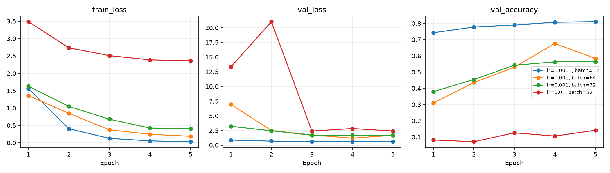
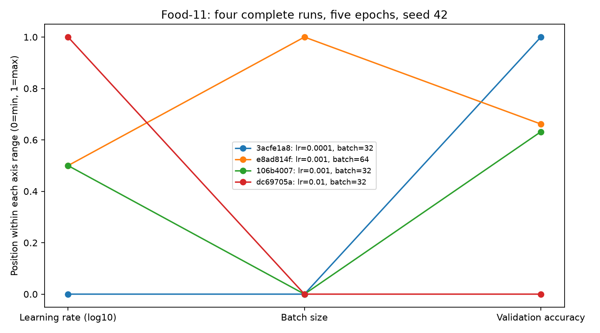

# Food-11 — Labs 1 et 2

Projet de préparation et de versionnement des données avec Git/DVC, puis entraînement et suivi d'expériences avec MLflow.

## Parcours de lecture pour la correction

| Élément | Contenu |
| --- | --- |
| [Rapport Lab 1](Labs.md/lab1.md) | Réponses aux 8 questions, données et versions |
| [Rapport Lab 2](Labs.md/lab2.md) | Réponses aux 9 questions, protocole et résultats |
| [Préparation complète](src/food11/data.py) | RGB 128×128, 11 catégories, splits officiels, mini ≤100 images/classe/split |
| [Entraînement](src/food11/train.py) | ResNet18 préentraîné, 11 sorties, paramètres CLI, suivi MLflow |
| [Comparaison](src/food11/compare_runs.py) | Quatre configurations et vérification des modèles sauvegardés |
| [Aperçu des images](data_preview) | Une image par catégorie, consultable sur GitHub |
| [Résultats détaillés](reports/lab2/comparison.json) | Paramètres, scores, statuts et identifiants des quatre runs |
| [Métriques par époque](reports/lab2/metrics.csv) | Export des mesures réelles depuis la base MLflow |
| [Pointeur DVC](data.dvc) | Version complète : 36 578 fichiers, raw + processed + mini |

Les exports ci-dessous sont des pièces du compte rendu : ils sont lisibles sans lancer MLflow. La base de suivi et les fichiers des modèles restent hors Git, conformément au lab.

## Résultats du Lab 2

Quatre entraînements terminés : cinq époques, seed 42, Adam, même mini-dataset, toutes les couches de ResNet18 entraînées.

| Learning rate | Batch size | Validation | Test |
| ---: | ---: | ---: | ---: |
| 0.0001 | 32 | **81,02 %** | **83,21 %** |
| 0.001 | 64 | 58,39 % | 59,76 % |
| 0.001 | 32 | 56,39 % | 57,21 % |
| 0.01 | 32 | 14,14 % | 15,60 % |

Le meilleur modèle est choisi sur la validation. Run : `3acfe1a891994c78b89de31feb99ef30`.





## Reproduire les labs

```powershell
git clone https://github.com/Ghandour-Ali/mlops-lab-1.git
cd mlops-lab-1
uv sync --locked
uv run dvc pull
```

Le stockage DVC utilise DagsHub et peut demander une authentification. Configurer son accès localement, sans publier de token :

```powershell
uv run dvc remote modify --local origin user VOTRE_UTILISATEUR_DAGSHUB
uv run dvc remote modify --local origin password VOTRE_TOKEN_DAGSHUB
uv run dvc pull
```

Si le téléchargement distant est indisponible, placer Food-11 original dans `data/food11_raw/{training,validation,evaluation}`, puis reconstruire les deux datasets :

```powershell
uv run python src/food11/data.py
```

Source : [Food-11 sur Kaggle](https://www.kaggle.com/datasets/karakaggle/food11). Le script exige des dossiers de sortie vides pour préserver les fichiers existants. Après un `dvc pull` complet, la préparation n'est pas nécessaire.

Dans un terminal, démarrer MLflow depuis la racine du dépôt :

```powershell
uv run mlflow server --host 127.0.0.1 --port 5000 --backend-store-uri sqlite:///mlflow.db --default-artifact-root ./mlruns --workers 1
```

Dans un autre terminal :

```powershell
uv run python src/food11/compare_runs.py --group lab2-reproduction --epochs 5 --run-missing
```

Ouvrir http://127.0.0.1:5000 et sélectionner `food11`. Cette adresse désigne le serveur de la machine qui l'ouvre : elle ne donne pas accès aux anciens runs de l'auteur. Les scores exportés plus haut permettent leur consultation à distance ; une reproduction crée de nouveaux runs.

## Versionnement des données — Lab 1

- Version brute : commit [`740a6e5`](https://github.com/Ghandour-Ali/mlops-lab-1/commit/740a6e5), 16 643 images.
- Version complète : `data.dvc` actuel, 36 578 images, hash `2292c4fa3fc6727803f77a0447e299a2.dir`.
- L'ancien commit intitulé « Create dataset version 2 » ajoutait un fichier, mais ne référençait pas les datasets préparés. Le pointeur actuel corrige cette omission sans réécrire l'historique.

```powershell
git log --oneline -- data.dvc
git checkout 740a6e5
uv run dvc pull
git checkout main
uv run dvc pull
```

Si les objets sont déjà en cache, `dvc checkout` suffit à la place de `dvc pull`. Pour garder les outils disponibles en visitant un ancien commit, utiliser l'environnement installé sur `main` (sans le resynchroniser).

Les fichiers volumineux restent dans DVC ; GitHub contient code, pointeurs et comptes rendus. Le statut du stockage distant et de son affichage est documenté dans le rapport du lab 1.

Contrôle du 17 septembre 2026 : transfert complet vers DagsHub et `dvc push` confirmé à jour. L'interface du miroir Git DagsHub reste à confirmer ; elle n'est pas nécessaire pour lire les rapports et résultats publiés ici.
